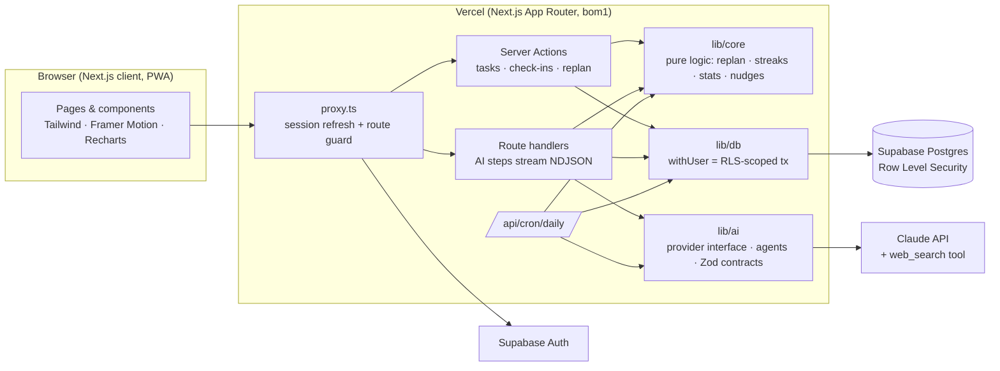
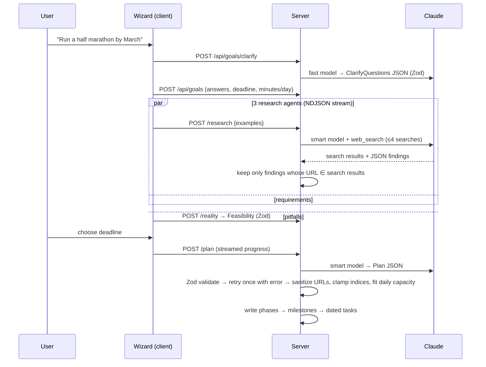

# AimTrack

**An AI goal-achievement system.** Write any goal in plain words. AimTrack researches how real people achieved it (with cited sources), gives you an honest reality check, builds a roadmap (Goal → Phases → Milestones → Weekly targets → Daily tasks), tracks you every day, and **adapts the plan** when you fall behind or get ahead.

- **Live app:** see the latest *Deploy* run's summary on GitHub (Actions → Deploy), or the URL in the repo description
- **Demo:** click **"Explore the live demo"** on the landing page. The shared demo account has 3 goals with weeks of history and is reset every night.

---

## Features

| Area | What it does |
|---|---|
| Goal wizard | Plain-language goal → 2–3 AI clarifying questions (level, budget, constraints) + deadline + minutes/day |
| Research agents | 3 parallel agents (real-life examples, requirements/costs, failure points) using live web search. **Every claim must link to a page the search tool actually returned, or it is dropped.** Live progress (queries, domains) is streamed to the UI. Cached per goal. |
| Reality check | Feasibility score 0–100, verdict, reasons, suggested deadline. You choose: keep / suggested / custom |
| Plan generator | Strict JSON contract validated with Zod, retried once with the validation error, then a friendly error. Tasks are fitted to your daily minutes. |
| Today | Tasks across goals, tick off with animation, log time, skip, **Lighten today** ("I only have 30 min"), **Pull forward** when ahead, 30-second check-in |
| Replanning | Deterministic engine: missed work goes into slack days in original order, never above your daily limit, trimmed on low-energy days. Every change is logged and explained. |
| Rolling horizon | The first 14 days are generated up front. After that, the next week is generated when fewer than 4 days remain, based on your recent completion rate |
| AI coach | Per-goal chat (streaming) that sees your roadmap, today's tasks, completion rate, streak, check-ins and replans |
| Reviews | Weekly review per goal (auto on Mondays) and monthly report: completion, streak, went well, slipped, one focus |
| Analytics | GitHub-style heatmap, streaks, weekly completion (vs *original* plan), planned vs actual time, time per goal, milestone progress, energy/mood trend, accessible data table |
| Nudges | Data-driven, never generic quotes ("2 more days to beat your record of 9", "energy low 3 days → today trimmed") |
| PWA | Installable, offline fallback page, dark/light themes, mobile-first bottom nav |

## Architecture



**Key design choices**

- **RLS on every query, not just in theory.** The server connects through Supabase's pooler and runs each request in a transaction with `set local role authenticated` + the user's JWT claims (`withUser()` in `src/lib/db/client.ts`). A buggy query physically cannot read another user's rows.
- **Pure core.** Replanning, streaks, stats and nudges are side-effect-free functions in `src/lib/core`, unit-tested in isolation.
- **One AI module.** Everything goes through the `AIProvider` interface (`src/lib/ai/provider.ts`). Claude is one implementation; swap providers by adding another implementation in `src/lib/ai/index.ts`. Keys never leave the server.
- **Offline mode.** With no AI key the app still works end to end using clearly-labelled templates, and does no fake research.

## AI pipeline



**Anti-hallucination guarantees**

1. Research items must carry a `source_url`; the schema rejects items without one.
2. `verifySources()` keeps an item only if its URL (normalised) is one the web-search tool actually returned in that request. Dropped items are counted and shown ("2 removed").
3. Plan `real_world_examples` and task `resource_url` must come from the verified research list. Otherwise the resource becomes an honest *search link* (`resource_query`).
4. If nothing is verifiable, the UI says **"No reliable source found"** instead of guessing.

**Failure handling:** SDK retries (429/5xx, exponential backoff) → mapped `AIError` codes with friendly messages → UI retry buttons per step. Long steps stream progress + heartbeats. `maxDuration` is set per route (≤300s on Hobby). Per-user daily AI budgets and a global daily cap (`AI_DAILY_CALL_CAP`) protect cost; the shared demo account has tighter budgets.

## Data model

`profiles`, `goals`, `research_runs` (cache + searched URLs), `research_findings`, `phases`, `milestones`, `tasks` (`scheduled_date` vs `original_date`, `moved_count`), `daily_checkins`, `replan_events`, `weekly_reviews` (weekly + monthly), `coach_messages`, `ai_calls` (rate limits). See `supabase/migrations/`.

## Local setup

Requirements: Node 22+, Postgres 15+ (local) or a Supabase project.

```bash
npm install
cp .env.example .env.local            # fill what you have; everything AI is optional

# Option A: fully local (no Supabase): local Postgres + built-in dev auth
createdb aimtrack
echo "DATABASE_URL=postgres://postgres@localhost:5432/aimtrack" >> .env.local
DATABASE_URL=postgres://postgres@localhost:5432/aimtrack npm run db:migrate:local   # adds a tiny auth shim, then migrations
npm run seed                          # demo account + sample data
npm run dev                           # http://localhost:3000 → "Explore the live demo"

# Option B: Supabase
# set DATABASE_URL (Transaction pooler), NEXT_PUBLIC_SUPABASE_URL, NEXT_PUBLIC_SUPABASE_ANON_KEY, SUPABASE_SERVICE_ROLE_KEY
npm run db:migrate && npm run seed && npm run dev
```

### Environment variables

| Name | Required | Notes |
|---|---|---|
| `DATABASE_URL` | yes | Supabase **Transaction pooler** URI (port 6543) |
| `NEXT_PUBLIC_SUPABASE_URL`, `NEXT_PUBLIC_SUPABASE_ANON_KEY` | prod | Supabase Auth. Without them, local dev auth is used |
| `SUPABASE_SERVICE_ROLE_KEY` | prod | Server-only. Creates the demo user |
| `GEMINI_API_KEY` + `TAVILY_API_KEY` | optional (free) | Google Gemini free tier for text + Tavily (1,000 free searches/month) for research |
| `ANTHROPIC_API_KEY` | optional (paid) | Claude with built-in web search. Used instead of Gemini when set |
| `AI_PROVIDER` | optional | Force `anthropic` or `gemini` |
| `AI_MODEL_SMART` / `AI_MODEL_FAST` | optional | Default `claude-sonnet-5` / `claude-haiku-4-5-20251001` |
| `AI_DAILY_CALL_CAP` | optional | Global AI calls per 24h (default 500) |
| `CRON_SECRET` | prod | Protects `/api/cron/daily` |
| `DEMO_EMAIL`, `DEMO_PASSWORD` | optional | Demo account credentials |
| `AUTH_SECRET` | local | Signs local-dev sessions |

## Testing

```bash
npm test            # 41 unit tests: plan contract + retry, citation verification, replanning, streaks, stats, nudges
npm run test:e2e    # Playwright (desktop + mobile): landing, auth guard, all app screens, task completion, full goal wizard
npm run lint && npm run typecheck
```

## Deployment (CI/CD)

**Default:** Vercel's Git integration. Every push to `main` builds with `npm run vercel-build`, which runs the idempotent migrations, refreshes the demo account, checks the AI keys and then builds. GitHub Actions `CI` runs lint, types, unit and E2E tests on every push.

**Optional fully scripted deploy:** `.github/workflows/deploy.yml` (manual trigger, needs repo secrets):

`.github/workflows/deploy.yml` on every push to `main`:

1. **CI**: lint, typecheck, unit tests, migrate + seed a throwaway Postgres, build, Playwright E2E
2. **Check AI key/models/web search** (fails fast with a clear message)
3. **Migrate Supabase** (`scripts/migrate.mjs`, idempotent, tracked in `_migrations`)
4. **Refresh demo data**
5. **Configure Vercel** via REST API (`scripts/vercel-setup.sh`): create project, public production, upsert env vars
6. **Deploy** with the Vercel CLI, resolve the production domain
7. **Smoke-test production** (`/api/health` + Playwright against the live URL)

A **Vercel Cron** (`vercel.json`) calls `/api/cron/daily` at 01:00 IST: replans, extends task horizons, writes weekly/monthly reviews, and resets the demo account.

## Costs

| Service | Plan | Monthly |
|---|---|---|
| Vercel | Hobby | ₹0 |
| Supabase | Free (500 MB DB, 50k MAU) | ₹0 (pauses after 7 days without traffic; the daily cron keeps it awake) |
| GitHub + Actions | Free | ₹0 |
| Google Gemini API | Free tier | ₹0 (rate-limited; Google may use free-tier data to improve its products) |
| Tavily search | Free (1,000 searches/month) | ₹0 (≈6 searches per new goal) |
| Anthropic API (optional upgrade) | Pay-as-you-go | ≈ $1–5/month personal use, ≈ $0.20–0.30 per new goal |

## Project structure

```
src/
  app/                 routes: landing, (auth), (app)/{dashboard,today,goals,analytics,settings}, api/*
  components/ui        design-system primitives (buttons, cards, dialogs…)
  components/app       product components (wizard, task item, charts, heatmap, coach…)
  lib/core             pure logic (replan, streak, stats, schedule, nudges, dates)
  lib/ai               provider interface, Claude impl, prompts, Zod schemas, agents, offline mock
  lib/db               RLS-scoped client + repository
  lib/services         planning, replanning, reviews, insights, coach context
  lib/seed             sample goals (real, verified sources) + demo account
supabase/migrations    SQL schema, RLS policies, hardening
tests/unit, tests/e2e  Vitest + Playwright
```

See **[DECISIONS.md](DECISIONS.md)** for the decision log and **[docs/INTERVIEW_SUMMARY.md](docs/INTERVIEW_SUMMARY.md)** for a one-page project summary.
